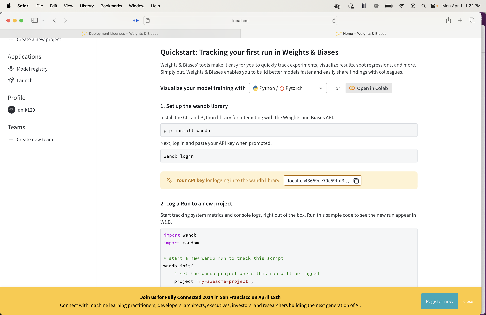
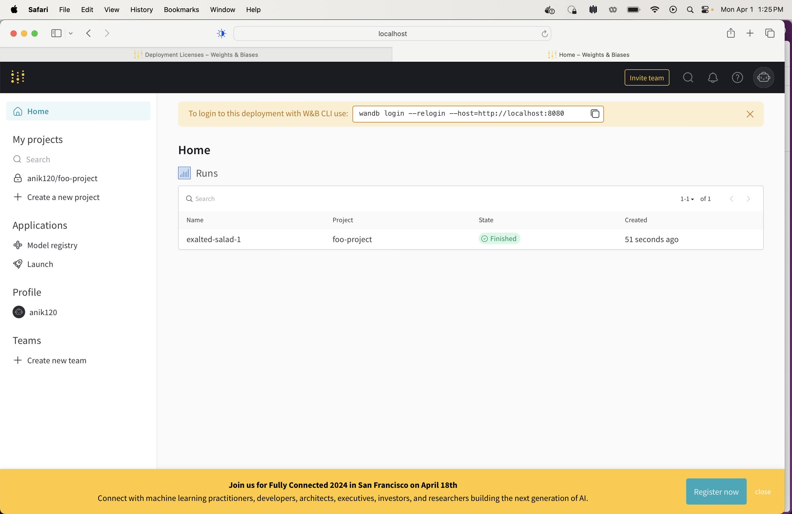

# Instructions on how to run a wandb server locally

## Pre-reqs

* Docker engine
* wandb

```
pip install wandb
```

### Start wandb

```
wandb server start
```

### Screenshot 1


### Screenshot 2


### Screenshot 3


### Screenshot 4


### Screenshot 5


### Screenshot 6


### Screenshot 7


### Screenshot 8


### Screenshot 9


### Screenshot 10


### Screenshot 11


### Screenshot 12


### Screenshot 13-maybe


### Screenshot 13


### Screenshot 14


### Screenshot 15


### Screenshot 16


### Screenshot 17



### Screenshot 18



